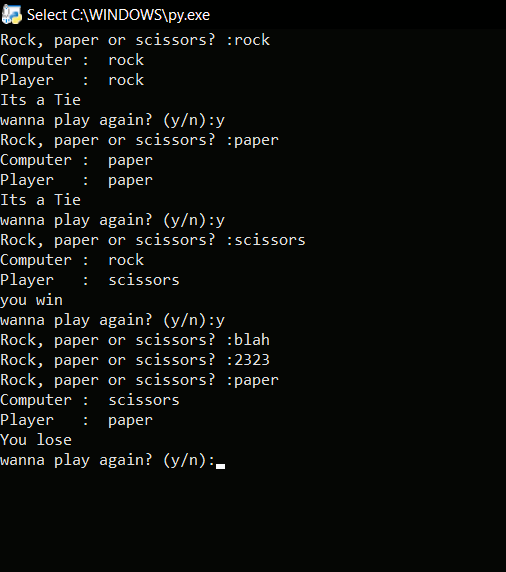

# Rock_Paper_Scissors 🗿📜✂️

Rock_paper_scissors is a simple strategic game with the following logic: "Rock crushes scissors, paper wraps rock, scissors cut the paper." I reconstructed the game logic in Python.

## 🚀 Features

- 😊 Play against the computer.
- 🔄 program will automatically run until user decides not to play again.
- 📬 Operations involved:
  - 🔗 Conditional statements
  - 👀 Selection statements
  - 📝 Loops

## 🛠️ Main Technologies

- `Python3`
  -`random`

## 📝 Process

I started learning Python and needed to create some projects based on what I learned. Some people recommended creating a rock-paper-scissor game,so I built it.

In this program, players can choose from the available options. If the player enters input from outside the options, it will be considered invalid input. However, the computer picks randomly from the options. We utilized the built-in random module for that.

After each game, the user will be prompted to continue or not. If the user decides not to play again, the program will exit from the loop; otherwise, the user may play as many times as they wish.

## 🤔 How Can It Be Improved?

It would be amazing if there is a score system to track down wins,loses and ties.

## 🐛 Current Bug

So far, I'm not really sure if there are any bugs.I have handled the invalid input problems. However, there might be some unseen issues please let me know if you found one.

<h3> 📸 - Demo Images </h3>

#

